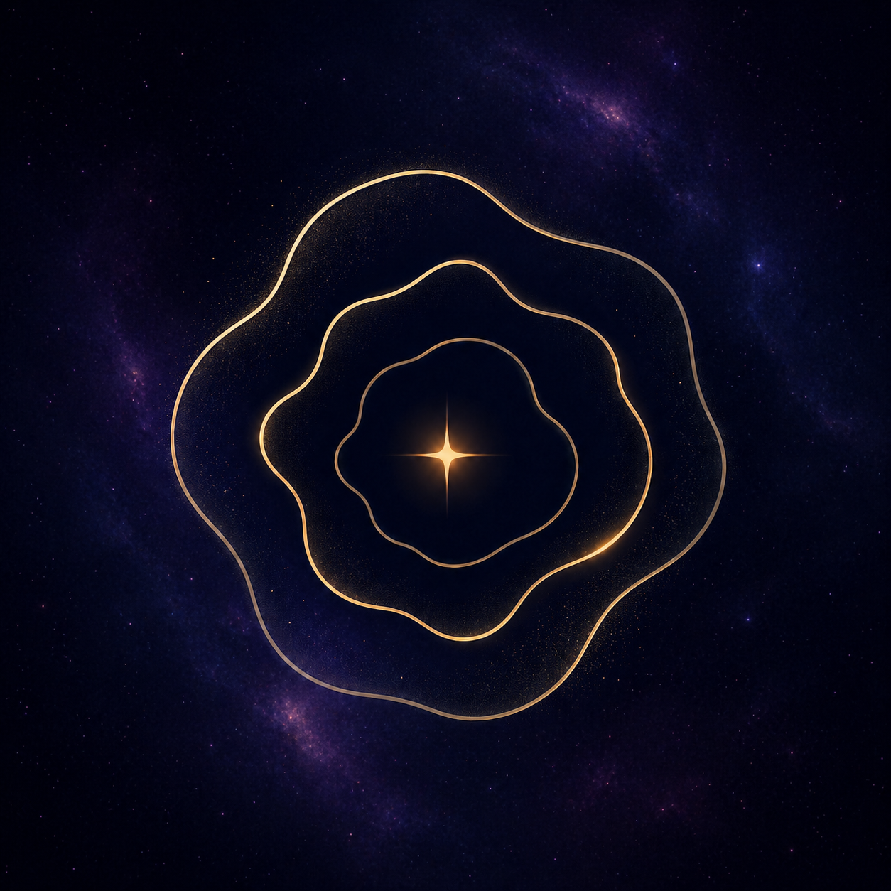
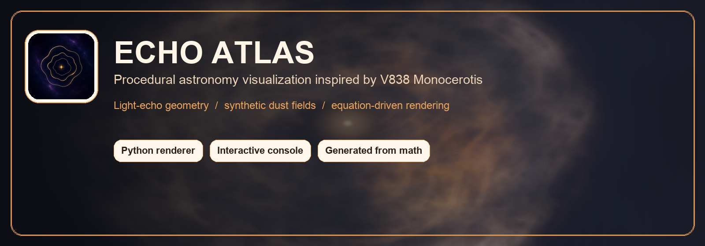
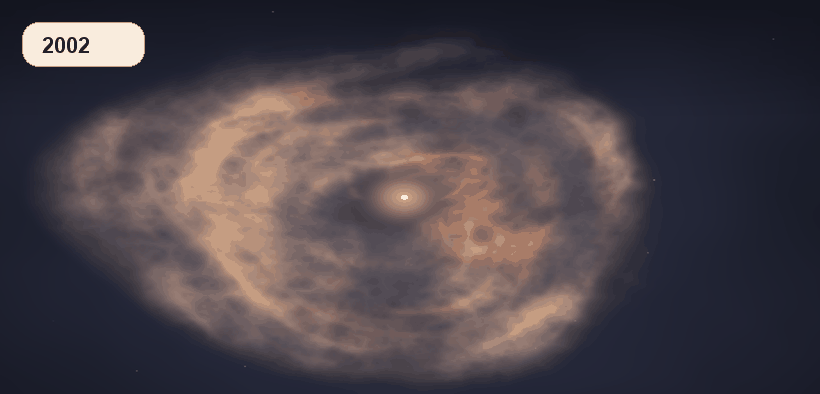
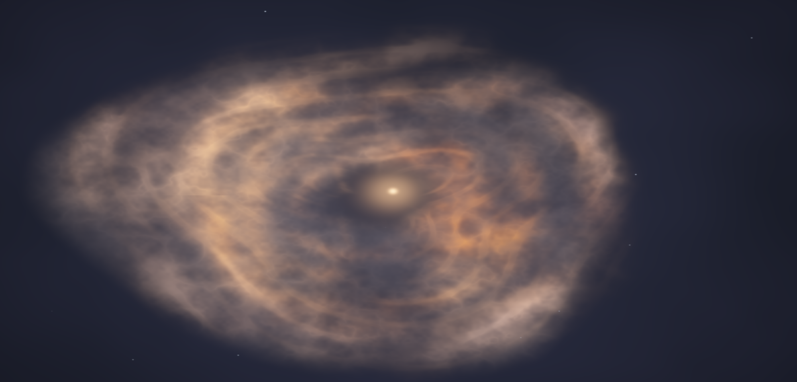
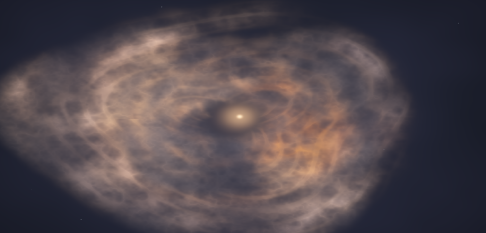
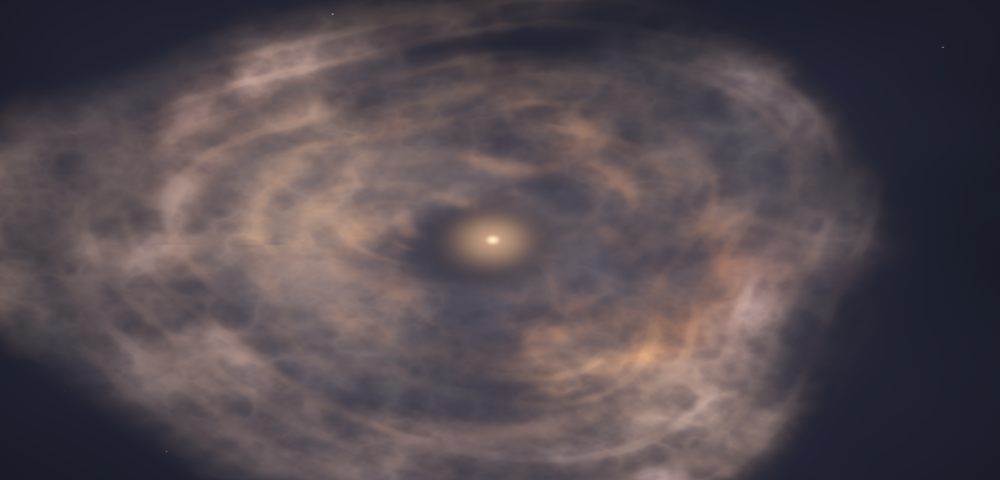

<div align="center">
  
  <h1>V838 Monocerotis Light Echo Study</h1>
  <p><strong>A procedural, math-driven visualization of V838 Monocerotis and its iconic expanding light echo.</strong></p>
  <p>
    <a href="https://youtu.be/jXmtfuEqThI"><strong>Demo Video</strong></a>
    |
    <a href="./index.html"><strong>Interactive Console</strong></a>
    |
    <a href="./render_v838.py"><strong>Renderer Source</strong></a>
  </p>
  <p>
    
    
    
    
  </p>
</div>

A procedural, math-driven visualization of **V838 Monocerotis**, inspired by the
famous Hubble light echo imagery that followed the star's 2002 outburst.

This project is built as a public-facing creative astronomy piece: a generated
image, a standalone browser console, and a reproducible Python renderer. The
goal is not to copy a single telescope frame pixel-for-pixel, but to recreate
the recognizable visual language of V838 Mon: a warm central source surrounded
by expanding, uneven, filamentary dust illuminated by a light echo.



## Preview



## Highlights

- Procedural recreation of V838 Monocerotis from mathematical fields.
- Standalone browser console with epoch presets, parameter controls, and PNG export.
- Reproducible Python renderer for default, epoch, and custom outputs.
- Light-echo-inspired geometry rather than flat accretion-disk or ring logic.
- Synthetic dust sheets, filament texture, asymmetric masking, and separate RGB transfer functions.

## Overview

V838 Monocerotis is visually defined by a **light echo**, not by an accretion
disk or a flat ring system. After the 2002 outburst, light from the central
star illuminated surrounding dust at increasing distances, revealing changing
shells, folds, gaps, and wispy structures over time.

This renderer models that idea with layered procedural fields:

- A small warm central star and soft inner halo.
- A paraboloid-like light echo surface moving through synthetic 3D dust sheets.
- Broken radial echo-front accents for nested shell detail.
- Filamentary dust texture from value noise, FBM, ridge noise, and trigonometric strata.
- Directional masks and angular gaps to avoid artificial symmetry.
- Separate RGB transfer functions for dense warm dust, thin cool scattering, shadows, and star glow.

The result is a structurally inspired V838 Mon visualization that feels closer
to illuminated interstellar dust than to a flat glowing disk.

## Interactive Console

Open `index.html` directly in a browser:

```sh
open index.html
```

The browser console includes:

- Epoch presets for 2002, 2004, and 2006-style echo phases.
- Controls for echo age, dust contrast, and core luminosity.
- Labeled color mapping swatches.
- A render preview action for custom parameter mixes.
- PNG export for the active generated image or rendered preview.
- Model notes showing the equation structure behind the image.

No build step or dev server is required. The app is intentionally portable and
can be copied as a static folder.

## Demo Video

Watch the project demo on YouTube:

[Echo Atlas demo video](https://youtu.be/jXmtfuEqThI)

## Generated Images

The browser app depends on these image artifacts:

| File | Purpose |
| --- | --- |
| `v838_monocerotis.png` | Default 2004-style reference render |
| `v838_monocerotis_2002.png` | Earlier, tighter light echo preset |
| `v838_monocerotis_2006.png` | Later, broader light echo preset |
| `echo_atlas_banner.png` | README and social-preview banner asset |
| `echo_atlas_preview.gif` | Lightweight epoch preview animation |

The three generated render PNGs are `2000 x 960` RGB images.

## Gallery

| 2002-style Echo | 2004-style Echo | 2006-style Echo |
| --- | --- | --- |
|  |  |  |

## Render From Source

Install the Python dependencies:

```sh
python3 -m pip install numpy pillow
```

Render the default image:

```sh
python3 render_v838.py
```

Render the included epoch presets:

```sh
python3 render_v838.py --epoch 2002 --output v838_monocerotis_2002.png
python3 render_v838.py --epoch 2004 --output v838_monocerotis.png
python3 render_v838.py --epoch 2006 --output v838_monocerotis_2006.png
```

Render a custom image:

```sh
python3 render_v838.py --width 2400 --height 1152 --phase 0.72 --seed 838 --output custom_v838.png
```

## Mathematical Model

At a high level, each pixel is computed from this composition:

```text
I(x,y) = S_star + (E_volume + E_shells) * T_dust * M_asym
```

Where:

- `S_star` is the warm central star and soft Gaussian halo.
- `E_volume` is the main light echo contribution from a moving echo surface intersecting synthetic dust sheets.
- `E_shells` adds faint warped shell accents.
- `T_dust` modulates intensity with filamentary texture.
- `M_asym` breaks symmetry with directional masks, clumps, and gaps.

The light echo surface is approximated with:

```text
z_echo = (r^2 - t^2) / 2t
```

Synthetic dust sheets are defined as:

```text
z_sheet_i = z_i + ax_i*x + ay_i*y + FBM_i(x,y)
```

The volume contribution uses Gaussian distance from the echo surface:

```text
E_volume = sum_i w_i * exp(-((z_echo - z_sheet_i)^2) / (2*sigma_i^2))
```

Filament structure comes from a blend of radial strata, angular lace, FBM, and
ridge noise:

```text
T_dust = ridge_noise(x,y) + radial_strata(r,theta) + angular_lace(x,y)
```

The RGB channels are not simple grayscale copies. Dense dust is pushed toward
rust and amber, thin scatter is allowed to drift toward blue-gray, and the
central source remains warm rather than white-hot.

## Project Structure

```text
v838-monocerotis/
  index.html                 Standalone interactive browser console
  logo.png                   Echo Atlas logo asset
  echo_atlas_banner.png      README / social preview banner
  echo_atlas_preview.gif     Lightweight epoch preview animation
  render_v838.py             Reproducible procedural renderer
  v838_monocerotis.png       Default 2004-style generated image
  v838_monocerotis_2002.png  2002-style generated preset image
  v838_monocerotis_2006.png  2006-style generated preset image
  README.md                  Project documentation
```

## Design Notes

This piece intentionally avoids the visual grammar of a blazing accretion disk.
The defining subject is the light echo: nested, broken, translucent dust
structures revealed by central illumination.

Important visual constraints:

- Keep the central star bright but not overwhelming.
- Avoid perfect circles and clean rings.
- Use asymmetry and incomplete shell segments.
- Preserve wispy, folded, cloud-like dust texture.
- Let the structure fade outward into darkness.
- Separate color behavior by density and scattering type.

## References

NASA and Hubble imagery used as visual reference:

- [V838 Monocerotis, March 2004 wide image](https://science.nasa.gov/asset/hubble/v838-monocerotis/)
- [Light echo sequence from V838 Monocerotis](https://science.nasa.gov/asset/hubble/light-echo-from-star-v838-monocerotis)
- [V838 Monocerotis, November 2005](https://science.nasa.gov/asset/hubble/v838-monocerotis-november-2005/)
- [Close-up of the light echo, September 2006](https://science.nasa.gov/asset/hubble/close-up-of-light-echo-around-v838-monocerotis-september-2006)

## Scientific Scope

This is an artistic procedural visualization, not a calibrated astrophysical
simulation. It does not reproduce exact telescope data, dust distances,
photometry, or scattering physics. The model is physically inspired in its use
of echo geometry and dust-sheet intersections, but it is tuned for visual
recognition and mathematical expressiveness.
